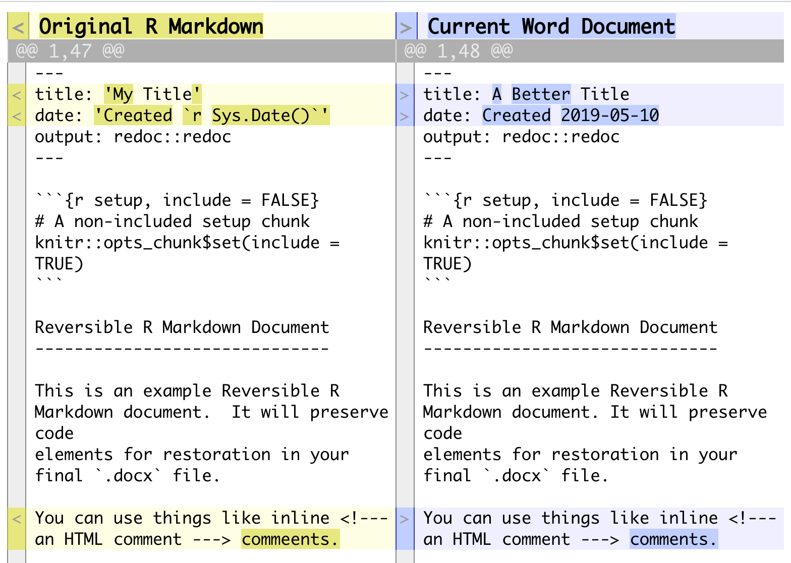

<!-- README.md is generated from README.Rmd. Please edit that file -->

```{r setup, include = FALSE}
knitr::opts_chunk$set(
  collapse = TRUE,
  comment = "#>",
  fig.path = "man/figures/README-",
  out.width = "100%"
)
options(width = 120)
```
# redoc - Reversible Reproducible Documents

<!-- badges: start -->
[{data-external="1"}](https://opensource.org/licenses/MIT)
[{data-external="1"}](http://www.repostatus.org/#wip)
[](https://travis-ci.org/noamross/redoc)
[{data-external="1"}](https://ci.appveyor.com/project/noamross/redoc)
[{data-external="1"}](https://codecov.io/gh/noamross/redoc)
[{data-external="1"}](https://cran.r-project.org/package=redoc)
<!-- badges: end -->

**redoc** is a package to enable a two-way R Markdown-Microsoft
Word workflow.  It generates Word documents that can be de-rendered back into
R Markdown, retaining edits on the Word document, including tracked changes.

**redoc** is not yet stable; its core engine and API are still subject to
change. It's been overhauled a few times already! I welcome your [contributions
and feedback](https://noamross.github.io/redoc/CONTRIBUTING.html).


## Installation

Install the **redoc** package with the **remotes** (or **devtools**) package:

```{r install_me, eval = FALSE}
remotes::install_github("noamross/redoc")
```

Note that **redoc** requires a recent version of Pandoc (>= 2.1.2). If you
have RStudio version 1.2 or higher, you should have this by default.

## Basic Usage

**redoc** provides an R Markdown [output
format](https://bookdown.org/yihui/rmarkdown/output-formats.html), 
`redoc()`, built on top of `rmarkdown::word_document()`. You will
typically call it via the YAML header in your R Markdown document. You have the
option of highlighting the outputs (both chunk and inline) in the Word Document.

```yaml
---
output:
  redoc::redoc
---
```

`redoc()` output resembles typical R Markdown Word output, but has some key
differences:

-  [Critic Markup](http://criticmarkup.com/spec.php#thebasicsyntax) edits will be
converted to Word tracked changes.
-  By default, parts of the documented generated programmatically will be
highlighted. (Change this with `highlight_outputs = FALSE`)
-  The original `.Rmd` and all code is stored internally in Word document for
later retrieval.

Word files that have been created by `redoc()` can be reverted to
`.Rmd` with the `dedoc()` function, _even after they are edited_. `dedoc()`
will return the path of the de-rendered document.

```{r unrender}
library(redoc)
print(basename(redoc_example_docx()))
dedoc(redoc_example_docx())
```

```{r cleanup, include = FALSE}
unlink("example.Rmd")
```

If the Word document has tracked changes, `dedoc()` will, by default, convert
these to back to Critic Markup syntax.  However, tracked changes are not
necessary.  You can view the changes between the original R Markdown file and
the de-rendered one using the `redoc_diff()` function.

```{r diff1, eval = FALSE}
redoc_diff(redoc_example_edited_docx())
```



More details and features can be found in the vignettes for
[users](https://noamross.github.io/redoc/articles/mixed-workflows-with-redoc.html)
and
[developers](https://noamross.github.io/redoc/articles/redoc-package-design.html).

## RStudio Integration

**redoc** has three RStudio Addins to simplify workflow when working with
R Markdown documents:

-   "Render and Update" renders an R Markdown Document and the updates the text
after round-tripping in to Word format and back.  This helps with cleaning
up small syntax differences (e.g. white space, line wrapping).
-   "Dedoc to active file" and "Dedoc to new file" de-render a file and place
the contents in RStudio editor tabs, and also display a the changes from
`redoc_diff()` in the RStudio viewer.

The package also contains a `dedoc` R Markdown template.

## Related Work

-  [**officedown**](https://github.com/davidgohel/officedown) produces rich
   MS Word documents from R Markdown. We hope for more integration between these
   packages in the future.
-  [**diffobj**](https://github.com/brodieG/diffobj) visualizes differences
   between R objects and drives **redoc**'s diff view.

## Contributing

Want have feedback or want to contribute? Great! Please take a look at the [contributing guidelines](https://github.com/noamross/redoc/blob/master/.github/CONTRIBUTING.md) before filing an issue or pull request. 

Please note that this project is released with a [Contributor Code of Conduct](https://github.com/noamross/redoc/blob/master/.github/CODE_OF_CONDUCT.md). By participating in this project you agree to abide by its terms.
