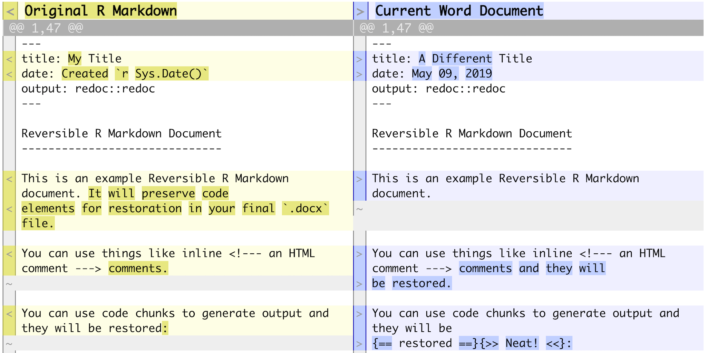

  
```{r, include = FALSE}
knitr::opts_chunk$set(
collapse = TRUE,
comment = "#>")
```

**redoc** is a package to enable a two-way R Markdown-Microsoft
Word workflow.  It generates Word documents that can be de-rendered back into
R Markdown, retaining edits on the Word document, including tracked changes.

## Installation

Install the **redoc** package with the **remotes** (or **devtools**) package:

```{r install_me, eval = FALSE}
remotes::install_github("noamross/redoc")
```

Note that **redoc** requires a recent version of Pandoc (>= 2.1.2). If you
have RStudio version 1.2 or higher, you should have this by default.

## Basic Usage

**redoc** provides an R Markdown [output
format](https://bookdown.org/yihui/rmarkdown/output-formats.html), 
`redoc()`, built on top of `rmarkdown::word_document()`. You will
typically call it via the YAML header in your R Markdown document:


```yaml
---
output: redoc::redoc
---
```

`redoc()` output resembles typical R Markdown Word output, but has some key
differences:

-  [Critic Markup](http://criticmarkup.com/spec.php#thebasicsyntax) edits will be
converted to Word tracked changes.
-  By default, parts of the documented generated programmatically will be
highlighted. (Change this with `highlight_outputs = TRUE`)
-  The original `.Rmd` and all code is stored internally in Word document for
later retrieval.

Word files that have been created by `redoc()` can be reverted to
`.Rmd` with the `dedoc()` function, _even after they are edited_. `dedoc()`
will return the path of the de-rendered document.

```{r cleanup1, include = FALSE}
unlink("example.Rmd")
```
```{r unrender}
library(redoc)
print(basename(redoc_example_docx()))
dedoc(redoc_example_docx())
```

```{r cleanup2, include = FALSE}
unlink("example.Rmd")
```

If the Word document has tracked changes, `dedoc()` will, by default, convert
these to back to Critic Markup syntax.  However, tracked changes are not
necessary.  You can view the changes between the original R Markdown file and
the de-rendered one using the `redoc_diff()` function.

```{r diff0, eval = FALSE}
redoc_diff(redoc_example_edited_docx())
```




Note that **redoc** tracks changes to parts of the document that are specified
in the YAML header - title, subtitle, author, and date.

## RStudio Integration

**redoc** has three RStudio Addins to simplify workflow when working with
R Markdown documents:

-   "Render and Update" renders an R Markdown Document and the updates the text
after round-tripping in to Word format and back.  This helps with cleaning
up small syntax differences. YAML headers, for instance, will use single rather 
than double quotes, only
quote when necessary,  and use `yes` and `no` instead of `TRUE` and `FALSE`.
Critic Markup annotations will be separated from adjacent text by a space.
Lines will be wrapped to a uniform width. If you round-trip your document this way,
you can minimize the changes that result from editing.  If you don't use the
Addin, you can retrieve the round-tripped document with `redoc_extract_rmd(..., type = 'roundtrip').`
-   "Dedoc to active file" and "Dedoc to new file" de-render a file and place
the contents in RStudio editor tabs, and also display a diff changes in
the RStudio viewer.

The package also contains a `redoc` R Markdown template.

## Handling changes

**redoc** attempts to be smart about restoring code in Word documents that have
been modified.  By default, if the outputs of code blocks move, the code
blocks will also move in the de-rendered R Markdown. Note that this can break
code if blocks are moved out of order. 

If code block outputs are deleted, the original code is restored, but wrapped in
HTML comments (`<!-- ... -->`). Inline code that is deleted is not restored.
Defaults of how code is restored can be modified via the `block_missing` and 
`inline_missing` arguments in `dedoc()`.

You can also extract the original R Markdown file used to produce a Word document
with `redoc_extract_rmd()`.

## Additional Features

The `redoc()` format has some additional arguments for formatting Word 
documents, `margins` and `line_numbers`.  These can be set in the YAML header
to modify your, er, margins and line numbering

```yaml
---
output:
  redoc::redoc:
    margins: 0.5 #sets margins to 0.5 inches
    line_numbers: TRUE # adds line numbers to the document
---
```

These can also take more complex lists of values for finer control.  These
functions may be migrated to
[**officedown**](https://github.com/davidgohel/officedown) at a future time.

## Known Limitations

- **redoc** does not work with `.docx` files edited with LibreOffice because of
differences between Word and LibreOffice files' internal structure.
-  Critic Markup comments can not be overlapping or nested.  If you convert
   a word document to markdown and back, comments will be out of place.


